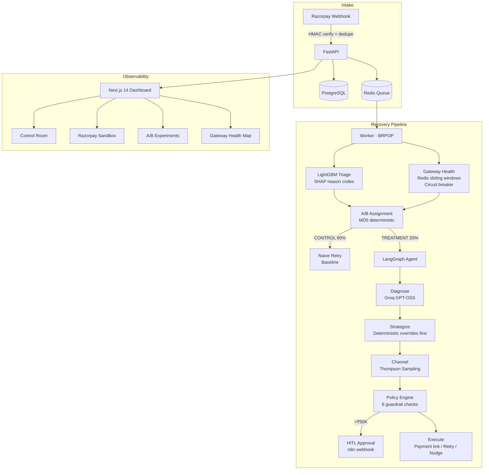

# RevenueGuard AI — Intelligent Payment Recovery Agent

> **Razorpay AI Buildathon 2026 · Track 03: AI Revenue Recovery**

An agentic system that detects failed Indian payments, scores recovery probability with ML, reasons about root cause with an LLM, and executes the optimal intervention — all within Razorpay's test-mode infrastructure.

[](https://your-video-link-here)
[](https://revenueguard-ai-five.vercel.app)
[](https://revenueguard-ai-2.onrender.com/api/health)

---

## The Problem

₹2.4 trillion in Indian digital payments fail annually. Most merchants have no recovery strategy beyond hoping the customer retries. The failure reasons matter: a bank timeout (SYSTEMIC) needs a delayed retry. Insufficient funds (CUSTOMER) needs a nudge. A business rule block (BUSINESS) needs human review. Treating them all the same wastes money and annoys customers.

---

## Architecture



---

## Eval Results (on 523 held-out test events)

| Metric | Value |
|---|---|
| **Precision** | **80.2%** |
| **Recall** | **80.5%** |
| **F1 Score** | **80.3%** |
| False Positive Cost | ₹20.25 |
| Agent Recovery Rate | **47.5%** (treatment arm, 122 cases) |
| Baseline Recovery Rate | 37.7% (control arm, 401 cases) |
| **Absolute Lift** | **+9.9 percentage points** |
| **Relative Lift** | **+26.3%** |
| P-value | **0.025** (significant at α=0.05) |
| SRM Check | ✅ PASS (χ²=3.62, p=0.057) |

> Eval artifacts: [`evals/results/summary.json`](evals/results/summary.json) · [`evals/results/rows.json`](evals/results/rows.json)

---

## Features

### Core Intelligence
- **ML Triage**: LightGBM champion + XGBoost challenger + calibrated LogReg baseline. SHAP reason codes (RC01–RC05) make every score explainable.
- **Failure Classification**: Separates SYSTEMIC (bank timeout → defer), CUSTOMER (insufficient funds → nudge), BUSINESS (rule violation → escalate). Critical for not wasting retries.
- **LangGraph Agent**: 10-node StateGraph — triage → gateway health → A/B assign → diagnose → strategize → channel select → policy check → HITL → execute → audit.

### Infrastructure
- **Gateway Health Engine**: Redis sorted-set sliding windows (5m/15m/60m) per bank/rail. Resilience4j-style 3-state circuit breaker (CLOSED/OPEN/HALF_OPEN) with exponential backoff.
- **A/B Experiment Framework**: Deterministic MD5 hashing for stable assignment. Two-proportion Z-test + SRM detection via scipy/statsmodels.
- **Thompson Sampling MAB**: MABWiser per customer segment (language × LTV × WhatsApp eligibility). `partial_fit()` on delayed recovery outcomes.
- **HITL Gate**: Deterministic `amount > ₹50,000` trigger. Creates approval record with 2h expiry. n8n Cloud webhook + dashboard approve/reject buttons.

### Real Razorpay Integration
- Live test-mode order creation via official Python SDK
- HMAC-SHA256 webhook verification (raw body read before JSON parse)
- Idempotency via `x-razorpay-event-id`
- Razorpay downtime API fused with internal circuit breaker
- Payment link creation for recovery

---

## Tech Stack

| Layer | Technology |
|---|---|
| **LLM** | Groq `openai/gpt-oss-120b` · OpenRouter fallback |
| **Agent** | LangGraph StateGraph |
| **ML** | LightGBM · XGBoost · scikit-learn · SHAP |
| **MAB** | MABWiser Thompson Sampling |
| **API** | FastAPI · Pydantic v2 · SQLAlchemy async |
| **DB** | PostgreSQL (prod) · SQLite+aiosqlite (dev) |
| **Queue** | Redis Lists (LPUSH/BRPOP) |
| **Frontend** | Next.js 14 App Router · Tailwind CSS v4 · shadcn/ui · Recharts · React Query |
| **Payments** | Razorpay Python SDK |
| **Deploy** | Render Blueprint · Vercel · Docker multi-stage |

---

## Quick Start (Local)

```bash
# 1. Clone and install
git clone https://github.com/YOUR_USERNAME/revenueguard-ai.git
cd revenueguard-ai
cp .env.example .env        # Fill in GROQ_API_KEY + RAZORPAY keys

pip install -r requirements.txt

# 2. Start infrastructure
docker compose up -d        # PostgreSQL + Redis

# 3. Start backend
uvicorn backend.api.main:app --reload --port 8000

# 4. Start worker (separate terminal)
python -m backend.worker

# 5. Start frontend (separate terminal)
cd frontend && npm install && npm run dev
# → http://localhost:3000

# 6. Generate synthetic data & run evals
python -m data.generate_batch --output data/test_batch.json --count 523
python -m evals.batch_runner
```

---

## Simulate Recovery (No Razorpay Keys Needed)

```bash
# Inject 50 synthetic failures and run the full pipeline
curl -X POST http://localhost:8000/api/simulate/batch -H "Content-Type: application/json" -d '{"count": 50}'

# Simulate a gateway outage (trips SBI UPI circuit breaker to OPEN)
curl -X POST http://localhost:8000/api/simulate/outage -H "Content-Type: application/json" -d '{"bank": "SBI", "rail": "upi"}'
```

---

## What Broke (Honest Postmortem)

**Razorpay webhook blacklist** — Razorpay blocks ngrok, webhook.site, and requestbin. Discovered this at midnight when test webhooks silently dropped. Fix: deployed to Render immediately to get a real public URL.

**MABWiser cold start** — Thompson Sampling needs real outcome data over days to converge. In a 48-hour hackathon, the bandit stays near-uniform. Mitigation: warm-started with 1 success + 1 failure per arm so it doesn't collapse to a single channel immediately.

**SQLite and async** — SQLAlchemy's async driver for SQLite requires `check_same_thread=False` and `aiosqlite` — not the same flags as sync SQLite. Lost ~2 hours debugging `sqlite3.ProgrammingError`. Fix: documented in `backend/db/database.py`.

**LightGBM on Windows** — `lightgbm` wheel on Windows 11 requires Visual C++ 2019 runtime. Not in `requirements.txt`. Added `lightgbm>=4.0.0` with a note in README.

**SHAP + LightGBM shape mismatch** — `shap.TreeExplainer` returns `(1, n_features, 2)` for binary classification. Had to squeeze the last dimension. Fixed in `triage_model.py:_get_shap_values()`.

**What we'd harden next**: Real customer contact via Razorpay Smart Collect + WhatsApp Business API. Persistent MAB state in Redis (currently in-memory, resets on restart). Proper Alembic migrations instead of `create_all`.

---

## Deployment (Render + Vercel)

**Backend + Worker + DB + Redis → Render Blueprint**
```bash
# In Render dashboard: New → Blueprint → Connect repo
# render.yaml provisions everything automatically
# Add secrets: GROQ_API_KEY, RAZORPAY_KEY_ID, RAZORPAY_KEY_SECRET, RAZORPAY_WEBHOOK_SECRET
```

**Frontend → Vercel**
```bash
# In Vercel: New Project → Import repo → Root directory: frontend
# Add env var: NEXT_PUBLIC_API_URL=https://revenueguard-api.onrender.com
```

**After deploy — register webhook in Razorpay Dashboard:**
```
URL: https://revenueguard-api.onrender.com/webhooks/razorpay
Events: payment.failed, subscription.halted, subscription.pending
```

---

## Project Structure

```
revenueguard-ai/
├── backend/
│   ├── agents/          # LangGraph nodes (triage, diagnose, strategize, channel, execute)
│   ├── api/             # FastAPI app + WebSocket event manager
│   ├── db/              # SQLAlchemy ORM models + async engine
│   ├── experiments/     # A/B assignment, baseline, statistical analyzer
│   ├── gateway_health/  # Redis aggregator + circuit breaker + downtime monitor
│   ├── guardrails/      # Policy engine + HITL gate
│   ├── integrations/    # Razorpay SDK wrapper + failure normalizer
│   ├── ml/              # Feature engineering, train, triage scorer, MAB bandit
│   ├── models/          # Enums, Pydantic schemas
│   └── webhooks/        # Razorpay handler + checkout API
├── data/                # Synthetic data generator + test_batch.json (523 events)
├── evals/               # Batch evaluator + results (summary.json, rows.json)
├── frontend/            # Next.js 14 dashboard (6 pages)
├── models/              # Trained ML artifacts (LightGBM + SHAP, ~980KB)
├── docker-compose.yml   # PostgreSQL + Redis for local dev
├── Dockerfile           # Multi-stage (Next.js → Python)
└── render.yaml          # Render Blueprint for one-click deploy
```
