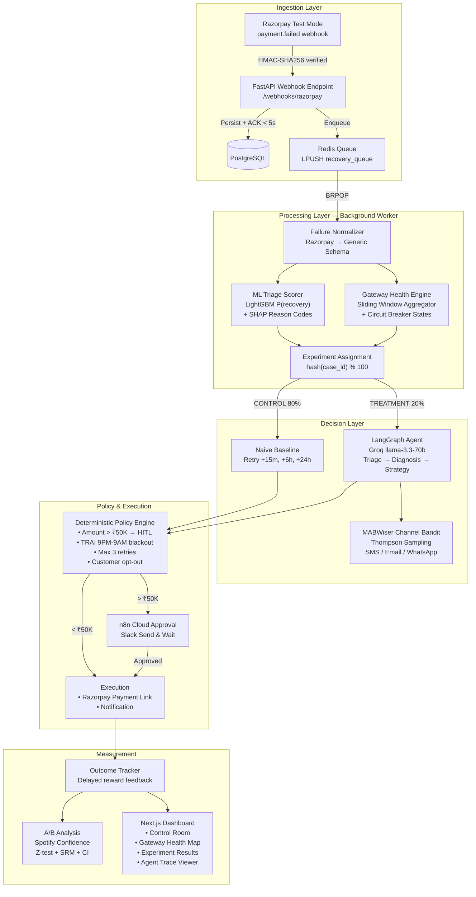

# RevenueGuard AI — Implementation Plan

> **Track 03: AI Revenue Recovery** — Razorpay Buildathon 2026
> *Find revenue that's slipping away and win it back*

> [!IMPORTANT]
> All innovation slots now have concrete implementations drawn from analyzed reference repos (Razorpay SDK, Juspay Decision Engine, Databricks Credit Decisioning, Fidelity MABWiser, Spotify Confidence, Databricks Banking Agent Accelerator). Architecture is toned down for a **16GB RAM Windows 11 machine**.

---

## System Constraints & Design Decisions

| Constraint | Decision |
|---|---|
| 16GB RAM, ~2GB free | No Kafka, no ClickHouse, no separate ML server. SQLite for dev, Postgres only in Docker/deployment |
| Windows 11 + Python 3.11 | All code runs natively on Windows. No Unix-only deps |
| Docker available | `docker-compose.yml` for Postgres + Redis only. App runs natively |
| **LLM: Groq / OpenRouter** | NOT OpenAI. Use `langchain-groq` with `llama-3.3-70b-versatile` or `langchain-openai` with OpenRouter base URL |
| **Deployment: Render** | User has no Railway account. Render free tier + paid upgrade for always-on demo |
| **n8n: Cloud free tier** | No self-hosting (saves RAM) |
| **Razorpay: Test account exists** | Real test-mode integration from day 1 |

### Production Concepts → POC Simplifications

| Production | POC Implementation |
|---|---|
| Kafka event streaming | Redis Lists (`LPUSH`/`BRPOP`) as lightweight queue |
| ClickHouse analytics | Postgres analytics views + in-memory aggregation |
| Separate ML model server | LightGBM model loaded in-process inside FastAPI worker |
| MLflow model registry | Versioned `.joblib` artifact committed to repo |
| Dedicated feature store | Postgres + Redis cache |
| GrowthBook/full A/B platform | 4-table experiment schema + Spotify Confidence for stats |
| OpenAI GPT-4o | Groq `llama-3.3-70b-versatile` (free, fast) or OpenRouter multi-model |

---

## Revised Architecture



---

## Tech Stack

| Layer | Technology | Why |
|---|---|---|
| **Agent Framework** | LangGraph (Python) | State machines, checkpointing, conditional routing |
| **LLM** | Groq `llama-3.3-70b-versatile` | Free tier, ~750 tokens/sec, structured JSON output. OpenRouter as fallback |
| **ML Models** | LightGBM + XGBoost | Recovery probability scoring — sub-50ms inference |
| **Explainability** | SHAP (TreeSHAP) | Reason codes for every ML decision |
| **Channel Selection** | MABWiser (Thompson Sampling) | Learns optimal SMS/email/WhatsApp per customer segment |
| **Backend** | FastAPI | Async, type-safe, Pydantic v2 |
| **Frontend** | Next.js 14 + shadcn/ui + Recharts | Modern dashboard with real-time updates |
| **Database** | SQLite (dev) / PostgreSQL (prod) | ACID transactions for financial data |
| **Queue** | Redis Lists (LPUSH/BRPOP) | Lightweight event queue |
| **Gateway Health** | Redis sorted sets + circuit breaker | Juspay decision-engine pattern |
| **A/B Testing** | Custom 4-table schema + Spotify Confidence | Deterministic hashing + proper statistics |
| **Workflow** | n8n Cloud (free tier) | HITL approval for high-value transactions |
| **Deployment** | Render (render.yaml Blueprint) | Declarative multi-service deployment |

---

## Proposed Changes (File-by-File)

### Component 1: Project Foundation & Data Models

#### [MODIFY] `pyproject.toml`
Updated dependencies — remove `openai`, add `groq`, `langchain-groq`. Remove NeMo Guardrails (too heavy). Key deps:
- `razorpay`, `groq`, `langchain-groq`, `langchain-core`, `langgraph`
- `lightgbm`, `xgboost`, `shap`, `scikit-learn`, `joblib`
- `mabwiser`
- `fastapi`, `uvicorn[standard]`, `sqlalchemy[asyncio]`, `aiosqlite`, `asyncpg`, `alembic`
- `redis`, `httpx`, `faker`, `pydantic-settings`
- `spotify-confidence` (or `statsmodels` + `scipy` as fallback)

#### [NEW] `backend/__init__.py`, `backend/models/__init__.py`, `backend/db/__init__.py`

#### [NEW] `backend/config.py`
Pydantic Settings with env vars:
- `GROQ_API_KEY` (primary LLM)
- `OPENROUTER_API_KEY` (fallback LLM)
- `LLM_PROVIDER`: `"groq"` | `"openrouter"` (default `"groq"`)
- `LLM_MODEL`: default `"llama-3.3-70b-versatile"`
- `RAZORPAY_KEY_ID`, `RAZORPAY_KEY_SECRET`, `RAZORPAY_WEBHOOK_SECRET`
- `DATABASE_URL`: default `sqlite+aiosqlite:///./revenueguard.db`
- `REDIS_URL`: default `redis://localhost:6379`
- Policy: `HIGH_VALUE_THRESHOLD=5000000`, `MAX_RETRY_ATTEMPTS=3`, `COOLDOWN_HOURS=24`, `QUIET_HOURS_START=21`, `QUIET_HOURS_END=9`
- `EXPERIMENT_VARIANT_PCT=20`
- `N8N_APPROVAL_WEBHOOK_URL`

#### [NEW] `backend/models/enums.py`
All enums: `EventType`, `EventStatus`, `FailureCategory` (CUSTOMER/SYSTEMIC/BUSINESS/UNKNOWN), `FailureSource`, `ActionType`, `RecoveryChannel`, `Priority`, `GatewayHealthState` (CLOSED/OPEN/HALF_OPEN), `ExperimentArm` (CONTROL/TREATMENT)

#### [NEW] `backend/models/schemas.py`
Pydantic v2 models:
- `NormalizedFailureEvent` — processor-agnostic (can work with Razorpay/Stripe/Cashfree)
- `CustomerProfile`, `TriageResult` (with `recovery_probability`, `shap_reason_codes`)
- `GatewayHealthSnapshot`, `DiagnosisResult`, `StrategyDecision`
- `RecoveryAction`, `ExperimentAssignment`, `ApprovalRecord`, `AuditLogEntry`, `RecoveryMetrics`

#### [NEW] `backend/db/database.py`
SQLAlchemy async engine — `aiosqlite` for dev, `asyncpg` for prod.

#### [NEW] `backend/db/orm_models.py`
11 ORM tables: `webhook_events`, `recovery_cases`, `recovery_actions`, `audit_logs`, `gateway_health_snapshots`, `experiments`, `experiment_assignments`, `experiment_results`, `recovery_approvals`, `channel_bandit_state`

#### [NEW] `backend/db/schema.sql`
Raw DDL for PostgreSQL (Render deployment init).

---

### Component 2: Razorpay Integration (Real Test Mode)

> [!IMPORTANT]
> You don't mark payments failed from the Dashboard. You trigger failures through Razorpay Checkout using `failure@razorpay` (UPI), mock bank Failure button (netbanking), or error-scenario test cards.

#### [NEW] `backend/integrations/razorpay_client.py`
Official `razorpay` SDK wrapper:
- `create_order()`, `fetch_payment()`, `fetch_downtimes()`, `create_payment_link()`, `verify_webhook_signature()`

#### [NEW] `backend/integrations/normalizer.py`
Razorpay → `NormalizedFailureEvent`. Critically separates technical declines (SYSTEMIC) from customer issues (CUSTOMER):
```
error_source=="bank" + timeout/gateway_error → SYSTEMIC
error_source=="bank" + insufficient_funds/wrong_pin → CUSTOMER
error_source=="customer" → CUSTOMER
error_source=="gateway"/"network" → SYSTEMIC
error_source=="business" → BUSINESS
```

#### [NEW] `backend/webhooks/razorpay_handler.py`
FastAPI webhook: raw body read → HMAC verify → idempotency dedup via `x-razorpay-event-id` → persist → enqueue → respond < 5s

#### [NEW] `backend/webhooks/checkout_api.py`
Demo endpoints: `POST /api/orders` creates real Razorpay test order, frontend opens Checkout.

---

### Component 3: ML Triage Scorer (LightGBM + SHAP)

> **ML scores. LLM reasons.** The LLM receives `0.73` as immutable context — it does NOT output `0.73`.

#### [NEW] `backend/ml/feature_engineering.py`
~20 features: `amount_log`, `failure_category`, `payment_method`, `bank_encoded`, `hour_of_day`, `customer_failure_rate`, `gateway_health_score`, `gateway_is_degraded`, etc.

#### [NEW] `backend/ml/train_model.py`
Trains LightGBM (champion) + XGBoost (challenger) + calibrated LogisticRegression (baseline) on synthetic data. Generates SHAP explainer. Saves to `models/`.

#### [NEW] `backend/ml/triage_model.py`
`TriageScorer.score()` → `TriageResult` with probability, priority, SHAP reason codes (RC01–RC05).

#### [NEW] `models/recovery_model.joblib`, `models/shap_explainer.joblib`
Pre-trained artifacts (~500KB).

---

### Component 4: Gateway Health Engine (Circuit Breaker)

> Pattern: Juspay decision-engine + Resilience4j sliding-window circuit breaker

#### [NEW] `backend/gateway_health/aggregator.py`
Redis sorted-set sliding windows (5m/15m/60m). Tracks success, technical_decline, business_decline, timeout per bank/rail.

#### [NEW] `backend/gateway_health/circuit_breaker.py`
Per-bank state machine: CLOSED → OPEN (failure_rate > 30% + sample > 50) → HALF_OPEN (after cooldown) → probe → CLOSED/OPEN.

#### [NEW] `backend/gateway_health/downtime_monitor.py`
Combines internal signal with Razorpay `GET /v1/payments/downtimes` API. Unified health = worse of two signals.

---

### Component 5: A/B Experiment Framework

> Pattern: Juspay decision-engine A/B + Spotify Confidence statistics

#### [NEW] `backend/experiments/assignment.py`
`hash(case_id) % 100` → stable CONTROL/TREATMENT split. All retries for same case stay in same arm.

#### [NEW] `backend/experiments/baseline.py`
Naive retry-everything: +15min, +6h, +24h. Same safety policies apply to both arms.

#### [NEW] `backend/experiments/analyzer.py`
SRM check + two-proportion Z-test + confidence intervals using `scipy.stats`/`statsmodels`. Only matured cases (7-day window).

---

### Component 6: LangGraph Agent Core

> Pattern: Databricks Banking Agent Accelerator — LLM handles language, deterministic components handle decisions.

#### [NEW] `backend/agents/state.py`
`RecoveryState` TypedDict with all fields for the graph.

#### [NEW] `backend/agents/graph.py`
LangGraph `StateGraph`:
```
START → enrich_ml → enrich_health → assign_experiment
  ├── CONTROL → baseline_decide → policy_check → execute
  └── TREATMENT → agent_diagnose → agent_strategize → select_channel → policy_check → execute
```

#### [NEW] `backend/agents/diagnosis_node.py`
LLM diagnosis using **Groq** (`ChatGroq` with `llama-3.3-70b-versatile`). ML score + gateway health provided as immutable context. Output: structured JSON `{root_cause, is_transient, reasoning}`.

#### [NEW] `backend/agents/strategy_node.py`
Deterministic overrides first (gateway OPEN → DEFER, opted_out → STOP), then LLM reasons about retry vs nudge vs payment link.

#### [NEW] `backend/agents/channel_node.py` (MABWiser)
Thompson Sampling per customer segment. `partial_fit()` on delayed recovery outcome.

#### [NEW] `backend/agents/execution_node.py`
Executes actions: Razorpay Payment Link, notification (logged), escalation, stop. All with idempotency keys.

---

### Component 7: Guardrails & Policy Engine

#### [NEW] `backend/guardrails/policy_engine.py`
**Deterministic** checks (not LLM-decided):
- `amount > ₹50K` → requires HITL approval
- `retry_count >= 3` → stop
- `cooldown 24h` between retries
- `9PM–9AM` IST quiet hours (TRAI)
- `customer.opted_out` → immediate stop
- `amount < ₹100` → cost exceeds value
- Backend **double-checks** approval record even if n8n says approved

#### [NEW] `backend/guardrails/hitl_gate.py`
Creates `PENDING` approval (expires 2h) → webhook to n8n Cloud → Slack Send & Wait → callback writes APPROVED/REJECTED.

#### [NEW] `n8n/workflows/high_value_approval.json`
Exported n8n workflow for Slack approval with timeout → email escalation.

---

### Component 8: Synthetic Data Generator

#### [NEW] `data/generator.py`
523 realistic Indian payment failure events. Banks: SBI/HDFC/ICICI/Axis/Kotak/PNB/BOB. Ground truth labels for evaluation. Razorpay-format error fields.

#### [NEW] `data/test_batch.json`
Pre-generated batch.

---

### Component 9: Evaluation Pipeline

#### [NEW] `evals/batch_runner.py`
Runs full pipeline against 500+ events. Produces formatted report with precision/recall/recovery rate/A/B comparison.

---

### Component 10: FastAPI Backend + Worker

#### [NEW] `backend/api/main.py`
Endpoints: webhook, orders, cases, metrics, gateway-health, experiments, approvals, simulate/batch, simulate/outage, WebSocket /ws/events.

#### [NEW] `backend/worker.py`
`BRPOP recovery_queue` → process through LangGraph → update DB → broadcast via WebSocket.

---

### Component 11: Next.js Dashboard

#### [NEW] `frontend/` — Next.js 14 + Tailwind + shadcn/ui + Recharts

Pages:
1. **`/` Control Room** — metrics cards, gateway health map, experiment snapshot, action buttons
2. **`/sandbox`** — Live Razorpay Sandbox (create order → checkout → webhook → recovery)
3. **`/cases`** — Filterable case table
4. **`/cases/[id]`** — Recovery journey timeline + agent reasoning trace
5. **`/experiments`** — A/B experiment dashboard with SRM check
6. **`/gateway-health`** — Full gateway health map with circuit breaker states

---

### Component 12: Infrastructure & Deployment

#### [NEW] `docker-compose.yml`
Postgres + Redis only. App runs natively.

#### [NEW] `Dockerfile`
Multi-stage build for Render deployment.

#### [NEW] `render.yaml`
Render Blueprint — web service + background worker + Postgres + Redis. Declarative.

---

## Project Structure

```
revenueguard-ai/
├── backend/
│   ├── __init__.py
│   ├── config.py                 # Pydantic Settings (Groq/OpenRouter)
│   ├── models/
│   │   ├── enums.py
│   │   └── schemas.py
│   ├── db/
│   │   ├── database.py
│   │   ├── orm_models.py
│   │   └── schema.sql
│   ├── integrations/
│   │   ├── razorpay_client.py
│   │   └── normalizer.py
│   ├── webhooks/
│   │   ├── razorpay_handler.py
│   │   └── checkout_api.py
│   ├── ml/
│   │   ├── feature_engineering.py
│   │   ├── triage_model.py
│   │   └── train_model.py
│   ├── gateway_health/
│   │   ├── aggregator.py
│   │   ├── circuit_breaker.py
│   │   └── downtime_monitor.py
│   ├── experiments/
│   │   ├── assignment.py
│   │   ├── baseline.py
│   │   └── analyzer.py
│   ├── agents/
│   │   ├── state.py
│   │   ├── graph.py
│   │   ├── triage_node.py
│   │   ├── diagnosis_node.py
│   │   ├── strategy_node.py
│   │   ├── channel_node.py
│   │   └── execution_node.py
│   ├── guardrails/
│   │   ├── policy_engine.py
│   │   └── hitl_gate.py
│   ├── api/
│   │   └── main.py
│   └── worker.py
├── frontend/                     # Next.js 14
├── data/
│   ├── generator.py
│   └── test_batch.json
├── evals/
│   └── batch_runner.py
├── models/
│   ├── recovery_model.joblib
│   └── shap_explainer.joblib
├── n8n/workflows/
│   └── high_value_approval.json
├── docker-compose.yml
├── Dockerfile
├── render.yaml
├── pyproject.toml
├── .env.example
├── .gitignore
└── README.md
```

---

## Execution Timeline (1-2 Days)

| Block | Phase | Time | Output |
|-------|-------|------|--------|
| **Day 1 AM** | Foundation (config, models, DB) | 45 min | All schemas, ORM, database |
| **Day 1 AM** | Razorpay Integration + Webhook | 30 min | Real SDK integration |
| **Day 1 PM** | Synthetic Data Generator | 30 min | 523 events |
| **Day 1 PM** | ML Triage Model (train + score) | 45 min | Trained LightGBM + SHAP |
| **Day 1 PM** | Gateway Health Engine | 30 min | Circuit breaker |
| **Day 1 EVE** | A/B Framework + MABWiser Bandit | 30 min | Experiment + channel selection |
| **Day 2 AM** | LangGraph Agent Core | 45 min | Full agent pipeline |
| **Day 2 AM** | FastAPI Backend + Worker | 45 min | Running backend |
| **Day 2 PM** | Next.js Dashboard | 60 min | Full dashboard |
| **Day 2 EVE** | Eval Pipeline + Deployment | 30 min | Eval report + Render config |

**Total Codex execution**: ~6.5 hours across 10 prompts

---

## Verification Plan

### After Each Prompt
Run the checkpoint command at the end of each Codex prompt.

### Full Integration Test (after Prompt 8)
```bash
docker compose up -d
python -m backend.api.run        # Terminal 1
python -m backend.worker         # Terminal 2
curl -X POST http://localhost:8000/api/simulate/batch -d '{"count": 20}'
curl http://localhost:8000/api/metrics
```

### Batch Evaluation (after Prompt 10)
```bash
python -m evals.batch_runner
```

### Live Razorpay Demo (manual)
1. Open `/sandbox` → Create Order → Checkout → `failure@razorpay` → watch recovery workflow
